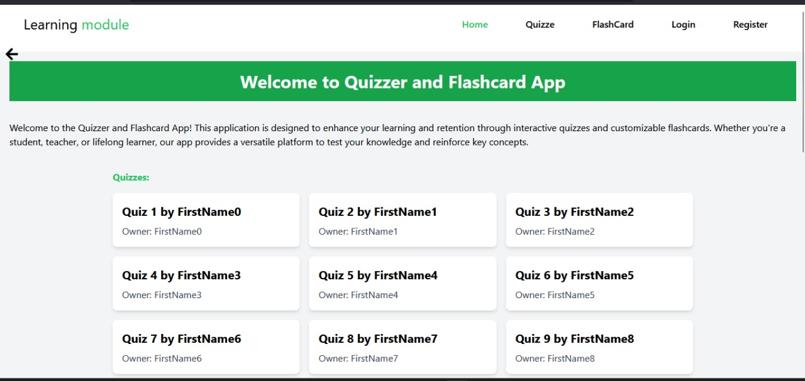
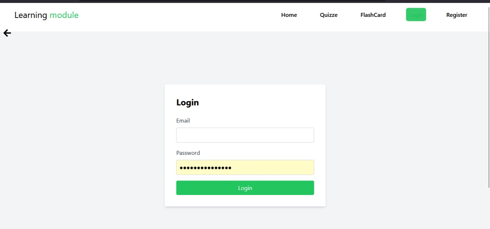
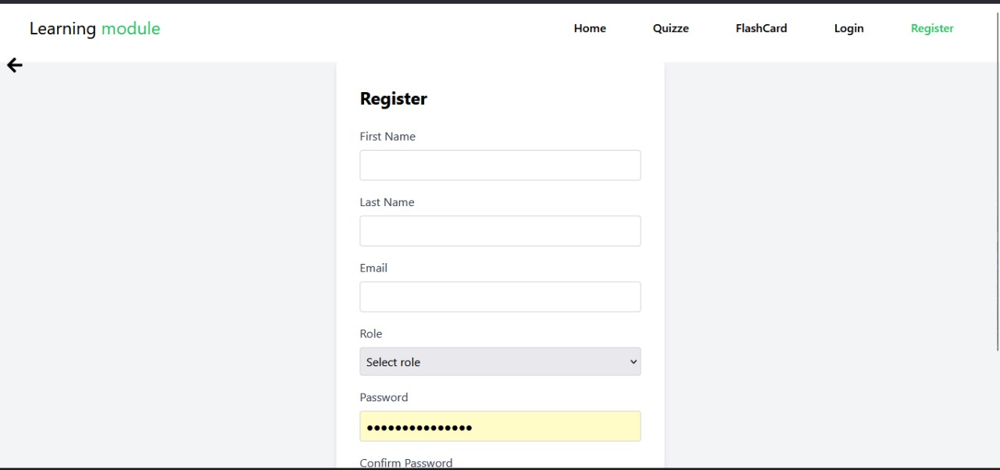
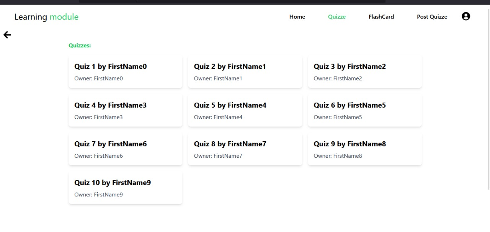
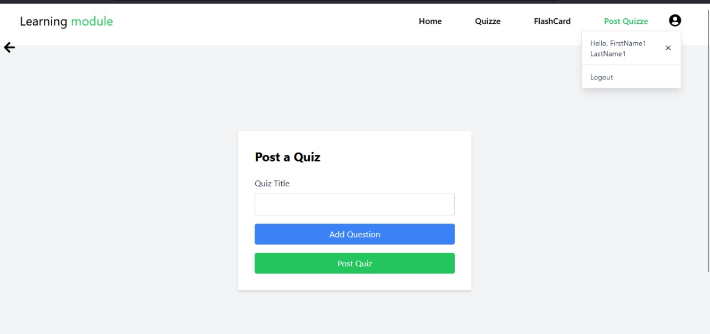
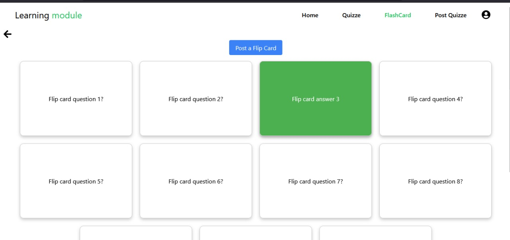
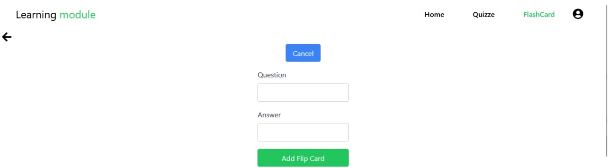
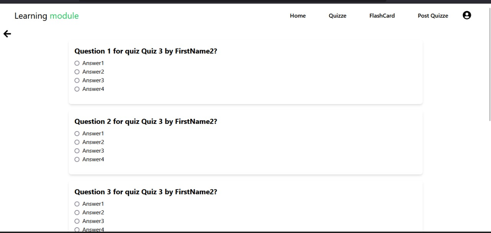

# learning-modules

## Personal Details

Full Names of contributer 1 - stanley Wanjau

Email - stanleywanjau371@gmail.com

Full Names of contributer 2 - Dennis Irungu

Email - irungud220@gmail.com

## Local Installation 

To clone this repository to your local environment and run the programm follow this steps

```bash 
    git git@github.com:stanleywanjau/learning-modules.git
```

This command will install all the required dependency

```bash
    npm install
```

To run the programm :

```bash
    npm start
```

After Running the frontend head over to the backend repository and follow the instructions to
run the backend which provided data for the frontend
[Backend Repository](https://github.com/irungudennisnganga/learning-backend-hackathon)

Here are some snapshot for the application

### Home page

<!--  -->

### Login Page


### Signup Page



### Quizes


### Quiz Post


### Flip page


### Add Flip Questions


### Test page
